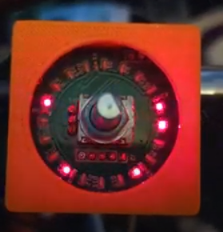

## Terminoligy

- Cycle
  - A time-specific iteration
- Phase
  - A specific pairing of high and low pins to drive the charlieplexing

## Troubleshooting

- Multiple additional lights illuminating
  - e.g. on transition from D5 to D6 being lit, 9, 13 and 17 also illuminate briefly.
  - 
  - Tried buffering state but did not initially solve the issue (see below)
  - Controller tries to clear all leds and then set only appropriate.  Appears to be behaving correctly.
  - Not visible on every transition.
  - Appears to not matter if I do the OUTSET or DIRSET first
  - All improperly illuminated pins are using the same sink pin as the pin that is being transitioned from.
  - Doesn't appear to be as problematic when debugging
  - Possibly it takes some time for the pin to go high-impedence?  Gate capacitance?
  - Nope, my buffering fix was just not right.  Using the un-buffered array for the DIRCLR was the issue.